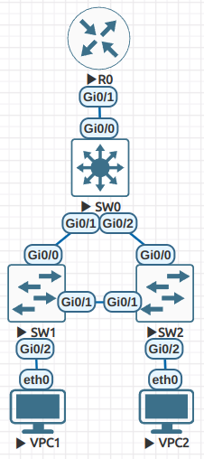

## СР 1 ##

### Параметры сети ###

1) VPC1

```
set pcname VPC1
ip 10.0.10.2/24 10.0.10.1
save VPC1.cfg
```

2) VPC2

```
set pcname VPC2
ip 10.0.20.2/24 10.0.20.1
save VPC2.cfg
```

3) SW1

```
    enable
       configure terminal
           hostname SW1
           vlan 10
               exit
           vlan 20
               exit
           interface gi 0/2
               switchport mode access
               switchport access vlan 10
               exit
           interface range gi 0/0-1
               switchport trunk encapsulation dot1q
               switchport mode trunk
               switchport trunk allowed vlan 10,20
               exit
           exit
        write memory
```

4) SW2

```
        enable
            configure terminal
                hostname SW2
                vlan 10
                    exit
                vlan 20
                    exit
                interface gi 0/2
                    switchport mode access
                    switchport access vlan 20
                    exit
                interface range gi 0/0-1
                    switchport trunk encapsulation dot1q
                    switchport mode trunk
                    switchport trunk allowed vlan 10,20
                    exit
                exit
            write memory
```

5) SW0

 ```
        enable
            configure terminal
                hostname SW0
                vlan 10
                    exit
                vlan 20
                    exit
                interface range gi 0/0-2
                    switchport trunk encapsulation dot1q
                    switchport mode trunk
                    switchport trunk allowed vlan 10,20
                    exit
                spanning-tree vlan 10 root primary
                spanning-tree vlan 20 root primary
                exit
            write memory
```

6) R0

```
        enable
            configure terminal
                hostname R0
                interface gi 0/1
                no shutdown

                interface gi 0/1.1
                    encapsulation dot1q 10
                    ip address 10.0.10.1 255.255.255.0
                    exit
                interface gi 0/1.2
                    encapsulation dot1q 20
                    ip address 10.0.20.1 255.255.255.0
                    exit
                exit
            write memory
```

### Топология сети и корректность ###

Топология сети собрана по схеме из задания



VPC1 находится в VLAN 10 и имеет адрес 10.0.10.2/24, VPC2 находится в VLAN 20 и имеет адрес 10.0.20.2/24

Клиенты могут отправить друг другу ping:

 ```
    VPC1> ping 10.0.10.2

    10.0.10.2 icmp_seq=1 ttl=64 time=0.001 ms
    10.0.10.2 icmp_seq=2 ttl=64 time=0.001 ms
    10.0.10.2 icmp_seq=3 ttl=64 time=0.001 ms
    10.0.10.2 icmp_seq=4 ttl=64 time=0.001 ms
    10.0.10.2 icmp_seq=5 ttl=64 time=0.001 ms

    VPC1> ping 10.0.20.2

    84 bytes from 10.0.20.2 icmp_seq=1 ttl=63 time=9.588 ms
    84 bytes from 10.0.20.2 icmp_seq=2 ttl=63 time=7.080 ms
    84 bytes from 10.0.20.2 icmp_seq=3 ttl=63 time=8.379 ms
    84 bytes from 10.0.20.2 icmp_seq=4 ttl=63 time=8.733 ms
    84 bytes from 10.0.20.2 icmp_seq=5 ttl=63 time=6.686 ms
```

```
    VPC2> ping 10.0.10.2

    84 bytes from 10.0.10.2 icmp_seq=1 ttl=63 time=17.683 ms
    84 bytes from 10.0.10.2 icmp_seq=2 ttl=63 time=6.103 ms
    84 bytes from 10.0.10.2 icmp_seq=3 ttl=63 time=8.145 ms
    84 bytes from 10.0.10.2 icmp_seq=4 ttl=63 time=6.996 ms
    84 bytes from 10.0.10.2 icmp_seq=5 ttl=63 time=13.530 ms

    VPC2> ping 10.0.20.2

    10.0.20.2 icmp_seq=1 ttl=64 time=0.001 ms
    10.0.20.2 icmp_seq=2 ttl=64 time=0.001 ms
    10.0.20.2 icmp_seq=3 ttl=64 time=0.001 ms
    10.0.20.2 icmp_seq=4 ttl=64 time=0.001 ms
    10.0.20.2 icmp_seq=5 ttl=64 time=0.001 ms
```

Работа действительно выполнена в EVE-NG, файлы конфигурации можно посмотреть в папке [configs](https://github.com/anomaliyamai/computer_networking_hw/tree/main/lab1/configs) и заодно прикладываю саму лабораторную [lab-01-v04.unl](https://github.com/anomaliyamai/computer_networking_hw/blob/main/lab1/lab-01-v04.unl)

### Топология и отказоустойчивость ###

Топология, которая будет так же оставаться рабочей в случае отказа одного из узлов. Учитывая конфигурацию, сеть должна выдерживать это.


